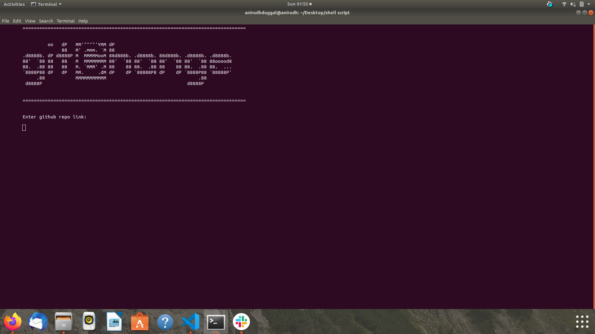

# gitChange
> gitChange is a command line tool that can be used to change files in a github repository

## Table of contents
* [General info](#general-info)
* [Screenshots](#screenshots)
* [Technologies](#technologies)
* [How To Use](#setup)
* [Features](#features)
* [Contact](#contact)

## General info
gitChange can be used for making simple changes like replacing a word in a file with some other word. As with the script, the word to be changed is fixed and is 'DEVOPS', but that could easily be replaced by a variable and used for any find and replace operation on a file.

## Screenshots


## Technologies
* shell (bash interpreter)

## How To Use
To use the script, simply save it as gitChange.sh
Then open your command line and enter the following command
```
bash gitChange.sh
```

## Features
The gitChange script can currently do the following tasks:
* Clone the mentioned repository
* Replace the word 'DEVOPS' with any user-defined word
* Add the changes to staging area
* Commit all the changes
* Push the changes to the remote github repository using user password or user's personal access token

## Contact
Created by [@anirudhduggal](https://www.github.com/anirudhdggl) - feel free to contact me!
